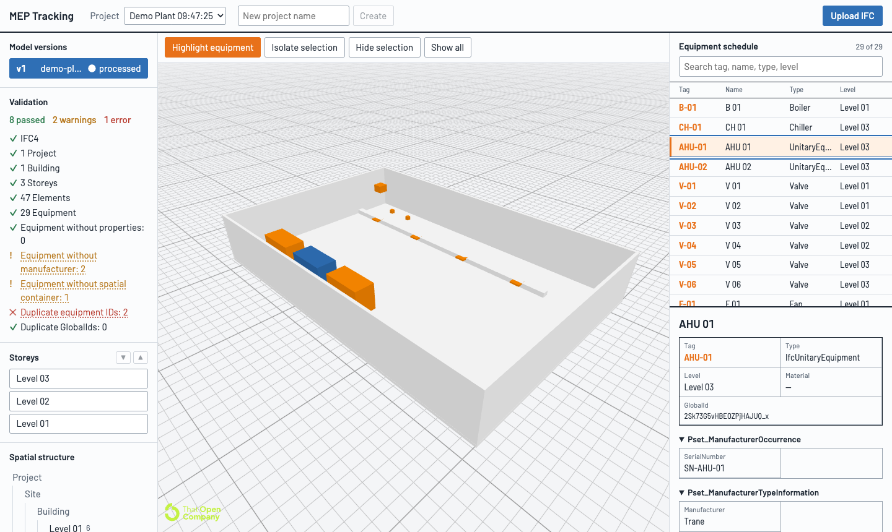
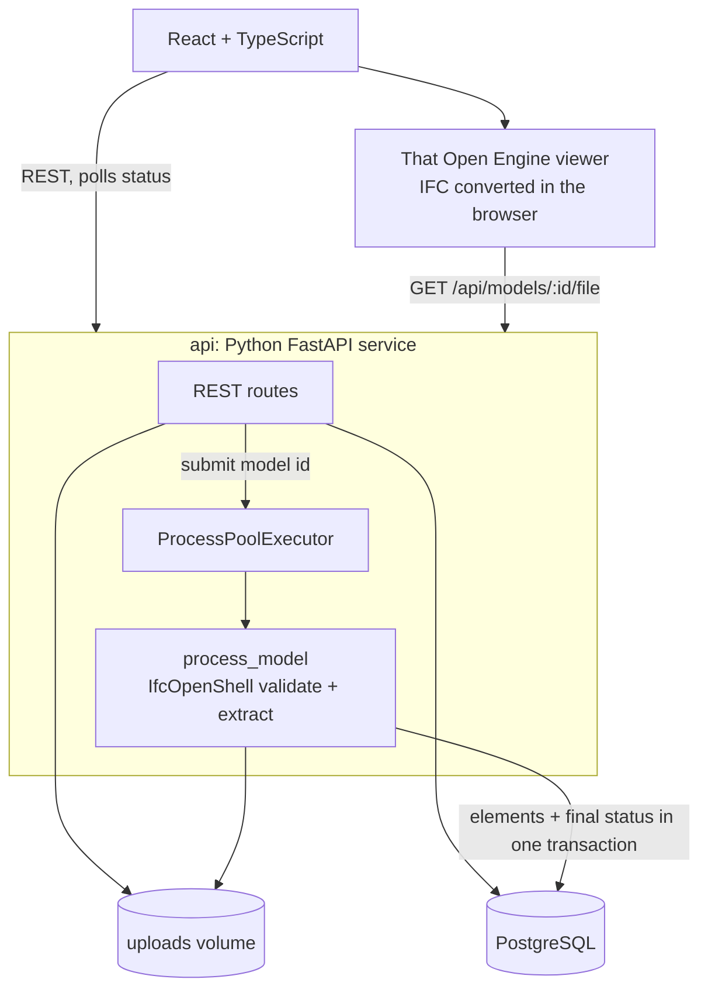

# MEP Tracking

OpenBIM equipment management for MEP systems: IFC → PostgreSQL → a 3D viewer in the browser, linked by IFC GlobalId.

Upload an IFC model and MEP Tracking validates it, extracts the building structure and every piece of equipment into PostgreSQL, and opens it in a That Open Engine viewer. The equipment schedule and the 3D model stay in sync: pick a pump in the list and the viewer frames it; click a chiller in 3D and its row and properties come up.



## What it does

- **Upload and process IFC in the background.** Each upload to a project becomes a new model version; the page shows status until processing finishes.
- **Validate model quality.** Each check is PASS, WARNING or ERROR: schema, project and building structure, storeys, equipment without properties, manufacturer or spatial container, duplicate tags and GlobalIds. Click a finding to select those elements in 3D.
- **Extract BIM data.** Spatial hierarchy, entity type, Tag, property sets (type values merged under occurrence values) and materials, stored as PostgreSQL `JSONB`.
- **Find equipment.** Equipment is every `IfcDistributionElement` except segments and fittings (ducts, pipes, elbows), so it works on any MEP model without configuration.
- **View in 3D.** That Open Engine on Three.js: highlight all equipment, isolate or hide the selection, show one storey at a time, inspect any element's properties.

Keyboard: `I` isolate, `H` hide, `A` show all, `F` frame all, `Shift+F` frame selection, `Esc` clear, double-click to frame.

## Quick start

Requires Docker.

```bash
docker compose up
```

Open http://localhost:3000, create a project, and upload `samples/demo-plant.ifc`. The API and its OpenAPI docs are at http://localhost:8000/docs.

## Architecture



| Part | Technology | Responsibility |
|---|---|---|
| `web/` | React, TypeScript, Vite, That Open Engine 3.4, Three.js | Upload, validation report, storeys, spatial tree, equipment schedule, 3D viewer |
| `api/` | Python 3.12, FastAPI, IfcOpenShell 0.9, psycopg 3, Alembic | REST API, background IFC processing, validation, migrations |
| `postgres` | PostgreSQL 16 | Projects, model versions, elements with `JSONB` property sets |

### Design decisions

- **One Python service.** IfcOpenShell is Python, so the API and the processing live together. Parsing runs in a separate process (`ProcessPoolExecutor`) so a large model never blocks API requests.
- **No queue.** An upload returns `202` right away; the browser polls `GET /api/models/:id`. If the API restarts mid-job, the model is marked `failed: interrupted` on startup.
- **One transaction per model.** Elements and the final status commit together, so a failed model never leaves half its rows behind.
- **GlobalId is the join key** between the viewer, the database, and later the 2D plan and BCF. The IFC line number (`express_id`) is stored as well; for IFC loaded by That Open it equals the viewer's local id, a proven fallback.
- **The browser converts the geometry.** The server never handles meshes; That Open turns the original IFC into fragments client-side.

Full requirements, design, test plan and implementation notes are in [`docs/ai/`](docs/ai/).

## Demo models

- **`samples/demo-plant.ifc`** is generated by `api/samples_demo_plant.py`: an IFC4 plant with 3 storeys, 29 pieces of equipment (boiler, chiller, AHUs, pumps, fans, valves, air terminals) and four deliberate defects for the validation report. To regenerate it:

  ```bash
  docker compose run --rm -v "$PWD/samples:/samples" api python samples_demo_plant.py /samples/demo-plant.ifc
  ```

- **Duplex apartment (real-world, IFC2X3).** Download the Duplex MEP model from WBDG's [Common BIM Files](https://www.wbdg.org/bim/cobie/common-bim-files) and upload it. It is not in the repository because its licence isn't stated.

## Development

```bash
# API unit tests (real PostgreSQL, warnings are errors)
docker compose run --rm api pytest -q --cov=app

# Integration tests against the running stack
docker compose up -d
docker compose run --rm -e STACK_URL=http://api:8000 -v "$PWD/samples:/samples:ro" api pytest -q tests/integration

# Web unit tests
cd web && npm ci && npm test

# End-to-end (Playwright, headless Chromium, needs the stack running)
cd web && npx playwright install chromium && npm run e2e
```

In development the API reloads on code changes and the web container runs Vite with hot reload.

## Roadmap

1. ~~IFC ingest, validation and 3D viewer~~ (done)
2. Equipment linking: import operational records and match them to IFC equipment by GlobalId, asset ID, tag, name, then type and location
3. Equipment pins coloured by status, detail cards, section planes
4. 2D floor plan per storey, synchronized with 3D
5. Viewer filters by storey, type, status and IFC property, with show-only, hide and highlight modes
6. Issues, tasks, saved viewpoints and an interactive dashboard
7. Simulated equipment telemetry

## Credits

- [That Open Engine](https://thatopen.com/) and [web-ifc](https://github.com/ThatOpen/engine_web-ifc) for the browser viewer
- [IfcOpenShell](https://ifcopenshell.org/) for server-side IFC processing
- Several viewer interaction ideas (keyboard shortcuts, storey navigator, clickable findings) come from [IFCViewX](https://github.com/nbharathik/ifc-viewx); no code was copied.
