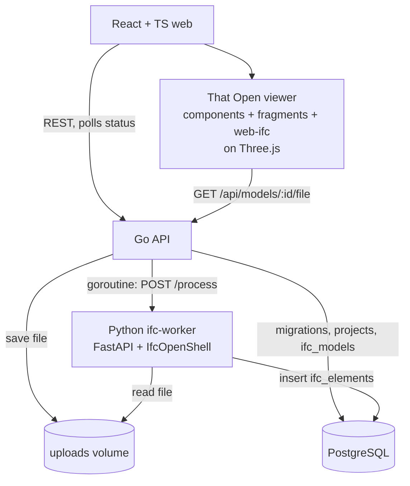
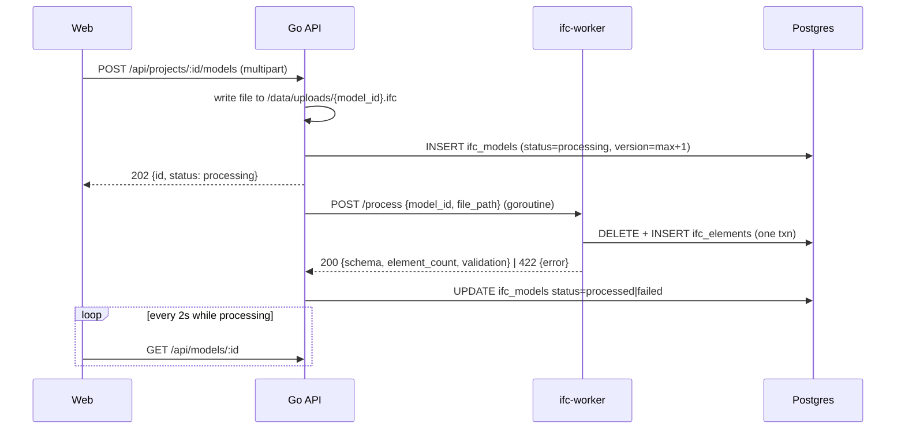

# Design — `ifc-ingest`

## Architecture Overview





| Component | Responsibility |
|---|---|
| `web/` | Vite + React + TS. Project picker, upload, model list, validation report, spatial tree, **3D viewer + equipment panel**. |
| `api/` | Go (stdlib `net/http` routing, `pgx`). REST, file intake, model status lifecycle, migrations. |
| `ifc-worker/` | Python 3.12, FastAPI, IfcOpenShell. Validate, extract, classify equipment, bulk insert. |
| `postgres` | PostgreSQL 16. |
| `docker-compose.yml` | Wires all four + `uploads` volume. |

## Data Models

```sql
CREATE TABLE projects (
  id          uuid PRIMARY KEY DEFAULT gen_random_uuid(),
  name        text NOT NULL UNIQUE,
  created_at  timestamptz NOT NULL DEFAULT now()
);

CREATE TYPE model_status AS ENUM ('processing', 'processed', 'failed');

CREATE TABLE ifc_models (
  id            uuid PRIMARY KEY DEFAULT gen_random_uuid(),
  project_id    uuid NOT NULL REFERENCES projects(id) ON DELETE CASCADE,
  version       int  NOT NULL,
  filename      text NOT NULL,
  file_path     text NOT NULL,
  ifc_schema    text,                 -- IFC2X3 / IFC4 / IFC4X3, set after processing
  status        model_status NOT NULL DEFAULT 'processing',
  error         text,
  element_count int,
  validation    jsonb,                -- see Validation report
  uploaded_at   timestamptz NOT NULL DEFAULT now(),
  processed_at  timestamptz,
  UNIQUE (project_id, version)
);

CREATE TABLE ifc_elements (
  id                 bigserial PRIMARY KEY,
  model_id           uuid NOT NULL REFERENCES ifc_models(id) ON DELETE CASCADE,
  global_id          text NOT NULL,
  ifc_type           text NOT NULL,   -- e.g. IfcPump
  name               text,
  object_type        text,
  tag                text,
  parent_global_id   text,            -- spatial parent (aggregate or containment)
  storey_global_id   text,            -- nearest IfcBuildingStorey ancestor
  is_spatial         bool NOT NULL,   -- Project/Site/Building/Storey/Space
  is_equipment       bool NOT NULL,
  properties         jsonb NOT NULL DEFAULT '{}',  -- {"Pset_X": {"Prop": value}}
  materials          jsonb NOT NULL DEFAULT '[]',  -- ["Steel", ...]
  UNIQUE (model_id, global_id)
);
CREATE INDEX ON ifc_elements (model_id, is_equipment);
CREATE INDEX ON ifc_elements (model_id, storey_global_id);
CREATE INDEX ON ifc_elements USING gin (properties);
```

- Spatial structure lives in `ifc_elements` (`is_spatial`, `parent_global_id`), so no separate `spatial_locations` table. That table gets added if PostGIS/2D needs it.
- Only `IfcProduct` instances are extracted (plus `IfcProject`). Relationship entities are flattened into `parent_global_id`; richer relationships are added when a slice needs them.
- Version = `COALESCE(MAX(version),0)+1` per project, computed inside the insert transaction. The unique constraint guards against races.

### Validation report (`ifc_models.validation`)

```json
{ "summary": {"pass": 5, "warning": 3, "error": 1},
  "checks": [
    {"code": "schema", "severity": "PASS", "message": "IFC4", "count": 1, "global_ids": []},
    {"code": "duplicate_tag", "severity": "ERROR", "message": "Duplicate equipment IDs", "count": 5, "global_ids": ["..."]}
  ] }
```

`global_ids` is capped at 100 per check.

| Code | Rule | Severity when violated (PASS otherwise) |
|---|---|---|
| `schema` | Schema in IFC2X3/IFC4/IFC4X3 | fatal → model `failed` |
| `project` | Exactly 1 IfcProject | ERROR |
| `building` | ≥ 1 IfcBuilding | ERROR |
| `storeys` | ≥ 1 IfcBuildingStorey (count reported) | WARNING |
| `elements` | Element count reported | PASS (info) |
| `no_equipment` | ≥ 1 equipment element | WARNING |
| `missing_properties` | Equipment with no property sets | WARNING |
| `missing_manufacturer` | Equipment lacking `Pset_ManufacturerTypeInformation.Manufacturer` (occurrence or type) | WARNING |
| `missing_container` | Equipment with no spatial container | WARNING |
| `duplicate_tag` | Equipment `Tag` (non-empty) shared by > 1 element | ERROR |
| `duplicate_global_id` | GlobalId repeated in file | ERROR |

## API Design

Go API (JSON, no auth):

| Method | Path | Notes |
|---|---|---|
| POST | `/api/projects` | `{name}` → 201 project; 409 if name exists |
| GET | `/api/projects` | list |
| POST | `/api/projects/{id}/models` | multipart `file`; `.ifc` only, ≤ 200 MB (413) → 202 model |
| GET | `/api/projects/{id}/models` | list, newest version first |
| GET | `/api/models/{id}` | model incl. `status`, `error`, `validation` (the polling target) |
| GET | `/api/models/{id}/file` | original IFC (`application/octet-stream`), only when `processed`; served with `http.ServeContent` (Range/ETag) |
| GET | `/api/models/{id}/elements/{globalId}` | one element with psets/materials; 404 if absent (viewer click → details) |
| GET | `/api/models/{id}/spatial-tree` | nested tree of spatial elements, each with element counts |
| GET | `/api/models/{id}/elements` | query: `equipment=true`, `storey=<gid>`, `type=IfcPump`, `limit`/`offset` (default 100, max 1000) |

Internal Go → worker:

- `POST /process` `{model_id, file_path}` → 200 `{ifc_schema, element_count, validation}` or 422 `{error}`. Synchronous. Go client timeout 10 min.
- `GET /health`.

## Component Breakdown

**ifc-worker (Python)**
- `open_model(path)` → schema check (fatal).
- `extract(model)` → rows: walk `IfcProduct`s; spatial parent via `ifcopenshell.util.element.get_container` / `get_aggregate`; storey = nearest `IfcBuildingStorey` ancestor; psets via `ifcopenshell.util.element.get_psets` (occurrence merged over type); materials via `get_materials`.
- `is_equipment(el)` → `el.is_a("IfcDistributionElement") and not (el.is_a("IfcFlowSegment") or el.is_a("IfcFlowFitting"))`.
- `validate(model, rows)` → report from the table above.
- `store(conn, model_id, rows)` → one transaction: `DELETE` existing rows for the model, then `COPY` insert (idempotent retries).

**api (Go)**
- `migrations/` embedded SQL, applied at startup via `golang-migrate`.
- Upload handler streams to disk with `http.MaxBytesReader`, then inserts the model and spawns `go process(modelID)`.
- Startup: `UPDATE ifc_models SET status='failed', error='interrupted' WHERE status='processing'`.

**web (React)**
- `ProjectPicker`, `UploadForm`, `ModelList` (polls every 2 s while any model is `processing`), `ValidationReport`, `SpatialTree`. Plain `fetch`; no state library.
- **`ModelViewer`** (That Open Engine v3: `@thatopen/components` 3.4, `@thatopen/components-front`, `@thatopen/fragments` 3.4, `web-ifc` ≥ 0.0.77, `three` ≥ 0.182):
  - `Components` + `Worlds` (scene, `SimpleRenderer`/`PostproductionRenderer`, orthographic/perspective camera with camera-controls), `Grids`.
  - Fragments worker initialised from the `@thatopen/fragments` worker file; `IfcLoader` with web-ifc WASM served from `web/public/wasm/` (no CDN at runtime).
  - Load: fetch `/api/models/{id}/file` → `ArrayBuffer` → `IfcLoader.load` → fragments model → fit camera.
  - Selection: `Highlighter` (components-front) on click → resolve fragment localId → GlobalId (fragments model GUID lookup) → `GET /elements/{globalId}` → `ElementPanel`.
  - Panel → 3D: GlobalIds → localIds via the reverse GUID lookup → `Highlighter.highlightByID` + camera fit to the item's bounding box.
  - `Hider` for hide / isolate / show all. "Highlight equipment" uses a second highlighter style over all equipment GlobalIds from `/elements?equipment=true`.
  - Exact v3 method names are confirmed against the installed typings during implementation (planning task: viewer spike).
- **`EquipmentPanel`**: searchable list from `/elements?equipment=true` (client-side filter on name/Tag/type/storey), selection shared with the viewer through one `selectedGlobalId` state in the page.
- **`ElementPanel`**: type, name, Tag, storey, psets table.

## Design Decisions

| Decision | Chosen | Alternatives | Why |
|---|---|---|---|
| Async | Goroutine + client polling | Redis queue; Postgres job table | Fewest moving parts. Restart recovery covered by the startup sweep. Revisit when processing must survive restarts or scale out. |
| Go↔Python | Worker HTTP service | Subprocess; worker polling DB | Clean service separation; each side testable alone. |
| Who writes elements | Python, direct to PG | Return JSON to Go | Avoids shipping large payloads over HTTP. Go still owns schema and status. |
| Storage | Docker volume | MinIO/S3 | Deferred to Phase 2 cloud deployment. |
| Spatial model | Rows in `ifc_elements` | Separate `spatial_locations` | One table, one query path. Split out when 2D/PostGIS needs it. |
| Viewer geometry | Browser converts IFC → fragments (That Open `IfcLoader`) | Server-side conversion + cached `.frag` | No extra service; demo model is small. Fragment caching is Phase 2 large-model optimization. |
| Viewer ↔ DB key | IFC GlobalId | fragment localId / express ID | GlobalId is stable across tools and versions, and later slices (linking, 2D sync, BCF) use it too. |
| Equipment rule | `IfcDistributionElement` minus segments/fittings | Allow-list; whole subtree | Schema-native, works on any MEP model. |

## Non-Functional Requirements

- Performance: demo model (~2k elements) processed in < 30 s; elements inserted via `COPY`. Viewer: demo model loaded in < 15 s, interactive frame rate on a laptop GPU.
- Compatibility: WebGL2 required; viewer shows a message otherwise.
- Upload: file streamed to disk, not buffered in memory; 200 MB cap.
- Reliability: worker failure or timeout → `failed` with message; reprocessing is idempotent.
- Security: only `.ifc` extension accepted, and files saved under a server-generated name (`{model_id}.ifc`), so no client path is used. Worker is not exposed outside the compose network.
